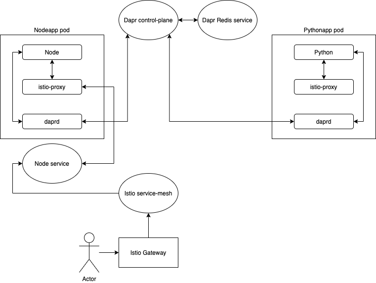

# Dapr & Istio - port capturing
This setup focuses on having Dapr and Istio, side-by-side without resigning the mTLS capacity of both services. This is achieved by manipulating the port capturing 

## Application setup



## Deploy application
The used manifests contains the following elements:
- `Namespace`, without `istio-injection: disabled` label. The workload in this namespace should contain both dapr and istio sidecars
- nodeapp `Deployment` and `Service`
- pythonapp `Deployment`
- `APIRule` for nodeapp, which exposes the service using [Kyma API-Gateway](https://github.com/kyma-incubator/api-gateway)

In the deployment we modify the sidecar-injection context using dapr and istio labels:

| Label | Explanation |
| :--- | :--- | 
| `dapr.io/enabled: "true"` | Enable application in dapr and inject sidecar |
| `dapr.io/id: "nodeapp"` | Uniqe ID of the app inside the dapr internal space |
| `dapr.io/port: "3000"` | Application port exposed by the app |
| `traffic.sidecar.istio.io/excludeOutboundPorts: "80,3500,50001,50002,6379"` | Set of ports that should be excluded from Istio outbound traffic capture. Those ports are used by dapr for internal communication.
| `traffic.sidecar.istio.io/excludeInboundPorts: "80,3500,50001,50002,6379"` | Set of ports that should be excluded from Istio inbound traffic capture. Those ports are used by dapr for internal communication.

```bash
kubectl apply -f ./manifests/test-app.yaml
# Wait till the applications deploy 
kubectl get pods -n dapr-demo
```

>**NOTE:** In case of failing containers, please verify if the sidecar injector image has been updated (failing readiness probes in istio-proxy sidecar), and the deployment has all required annotations (connection refused in dapr sidecar)

## Access the app
```bash
KYMA_DOMAIN=$(kubectl get cm -n kyma-installer net-global-overrides -o jsonpath='{.data.global\.ingress\.domainName}')
curl -ik https://nodeapp.${KYMA_DOMAIN}/order
```
