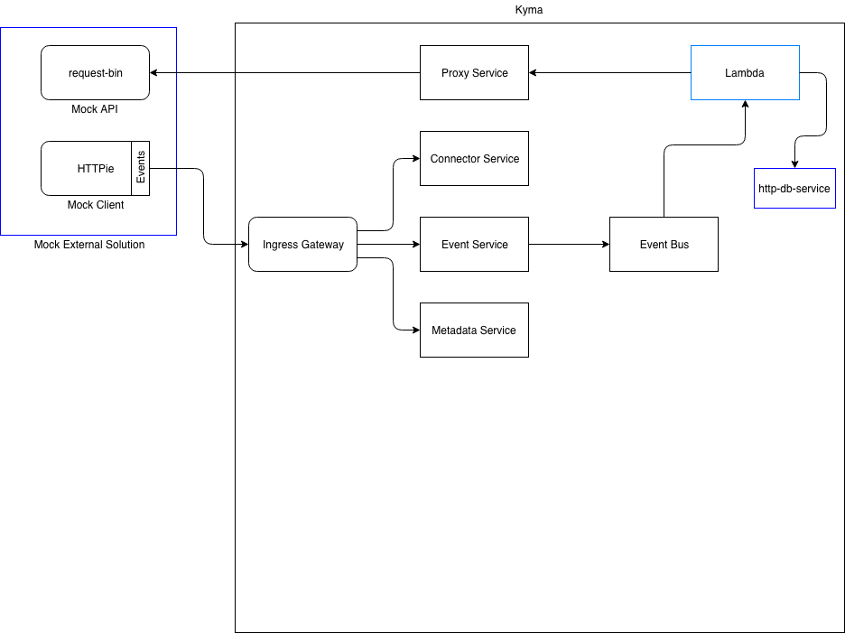

# Description
This is an example scenario which demonstrates how Kyma can be integrated with an external solution. For enabling developers, this scenario is targeted for a **local Kyma installation**.

The external solution provides (events and APIs). Both these are mocked in this example scenario.

* Sending of events is mocked by using a HTTP Client.
* APIs are mocked by using [request logger bin service][request-logger-bin]

You can use any other real solutions or mocks that you want to try.

The runtime flow involves following steps:

* External solution sends an `order.created` event.
* The event is accepted by Kyma.
* Event triggers the deployed lambda.
* Lambda makes API call to external solution to get additional order details.
* Lambda stores the data in the `http-db-service`.




# Set up

## Start Kyma locally
* Refer these [instructions](https://github.com/kyma-project/kyma/blob/master/docs/kyma/docs/030-inst-local-installation-from-release.md)

## Create Kyma environment
* Throughout this workshop we use `workshop` environment so please create it first.
* If you desire to use a different environment then change each `workshop` here with your desired environment name.

## Establish secure connection between external solution and Kyma

We will set up the secure connectivity between the mock external solution and the Kyma remote environment `ec-default`.

Here we will use the [connector service](https://github.com/kyma-project/kyma/blob/master/docs/application-connector/docs/010-architecture-connector-service.md) to secure the communication.

* Clone this [repository](https://github.com/kyma-project/kyma/blob/master/docs/application-connector/docs/015-details-one-click-configuration.md).

* Copy the token
  * Navigate to the `Administration --> Remote Environment --> ec-default`
  * `Connect Remote Environment`
  * Copy the token to the clipboard
  
* Use the one-click-generation [helper script](https://github.com/janmedrek/one-click-integration-script) to generate the certificate

  ```
  ./one-click-integration.sh -u <paste token here>
  ```
  This will generate a `generated.pem` file. This contains the signed certificate and key that we will use for subsequent communications.

  > **NOTE** The token is short-lived. So either hurry up or regenrate the token
  
## Node port
The Node port will be used for making the calls to Kyma.

  ```
  export NODE_PORT=$(kubectl get svc -n kyma-system application-connector-nginx-ingress-controller -o jsonpath='{.spec.ports[?(@.name=="https")].nodePort}')
  ```

## Mock External solution

* Calls from external solution to kyma
  * Use any http client e.g curl, httpie, postman etc.

* Calls from kyma to external solution
  * Use a dummy http server that can provide expected response for the External Solution APIs being used
  * We will use [Request Logger Bin][request-logger-bin], but you are free to use any solution fit.


## Register External solution APIs
The APIs are the one which Kyma will be calling. In this example, it is simple mockbin with returns some order details.

* Modify the [register-service.json](register-service.json) with the URL to which you want Kyma to make calls for the External Solutions APIs or update the URL of bin created by you.

* Register a service via the metadata api using [register-service.json](register-service.json)

    ```
    # Using httpie
    http POST https://gateway.kyma.local:${NODE_PORT}/ec-default/v1/metadata/services --cert=generated.pem --verify=no < register-service.json
    # Using curl
    curl -X POST -H "Content-Type: application/json" -d @./register-service.json https://gateway.kyma.local:${NODE_PORT}/ec-default/v1/metadata/services --cert generated.pem -k
    ```

* Verify
  * Navigate to Administration --> Remote Environments --> ec-default
  * You should be able to see the registered API

## Register Events

* Register events via the metadata api using [register-events.json](./register-events.json)
    
	```
    # Using httpie
    http POST https://gateway.kyma.local:${NODE_PORT}/ec-default/v1/metadata/services --cert=generated.pem --verify=no < register-events.json 
    # Using curl
    curl -X POST -H "Content-Type: application/json" -d @./register-events.json https://gateway.kyma.local:${NODE_PORT}/ec-default/v1/metadata/services --cert generated.pem -k
    ```
	
* Verify
  * Navigate to Administration --> Remote Environments --> ec-default
  * You should see the registered events.

## Bind Remote Environment

* Navigate to Administration --> Remote Environments --> ec-default
* Create a binding with the Kyma environment `workshop`.


## Add events and APIs to the Kyma Environment

* Navigate to Service Catalog for Kyma environment `workshop`

* You should see the registered APIs and events available.
* For both click on the details
* Add to your environment
* Check under `Service Instances` if they appear

## Deploy service

* Deploy the [http-db-service deployment](https://github.com/kyma-project/examples/tree/master/http-db-service/deployment) to Kyma environment `workshop`

* Access the service locally using port-forward
  * `kubectl port-forward -n workshop $(kubectl get pod -n workshop -l example=http-db-service -o jsonpath='{.items[0].metadata.name}') 8017:8017`
  * Accessing http://localhost:8017/orders returns empty json.

## Create Lambda

* Create the lambda definition in `lambda ui` using [lambda.js](./lambda.js)
  * Add label `app:<name-of-the-lambda>`
* Add dependencies using the [package.json](package.json)
* Select function trigger as event trigger, then choose `order.created`
* Add `Service Instance Binding` for each service instances

# Runtime
## Publish the event
    ```
	# using httpie
    echo '{"event-type" : "order.created", "event-type-version" : "v1", "event-time" : "2018-05-02T22:08:41+00:00", "data" : {"orderCode" : "1234"}}'|http POST https://gateway.kyma.local:${NODE_PORT}/ec-default/v1/events --cert=generated.pem --verify=no
	
	# using curl
	echo '{"event-type" : "order.created", "event-type-version" : "v1", "event-time" : "2018-05-02T22:08:41+00:00", "data" : {"orderCode" : "1234"}}'|curl -X POST -d @- https://gateway.kyma.local:${NODE_PORT}/ec-default/v1/events --cert generated.pem -k
    ```

# Verification

* **Lambda was triggered**
  * Inspect the pod logs for lambda in `workshop` environment
* The call to `mock bin` from lambda succeeded

* Accessing the url for order service http://localhost:8017/orders, you should see the orders list updated

# Tracing
* Traces are available under <https://jaeger.kyma.local/>


[request-logger-bin]: https://requestloggerbin.herokuapp.com/
