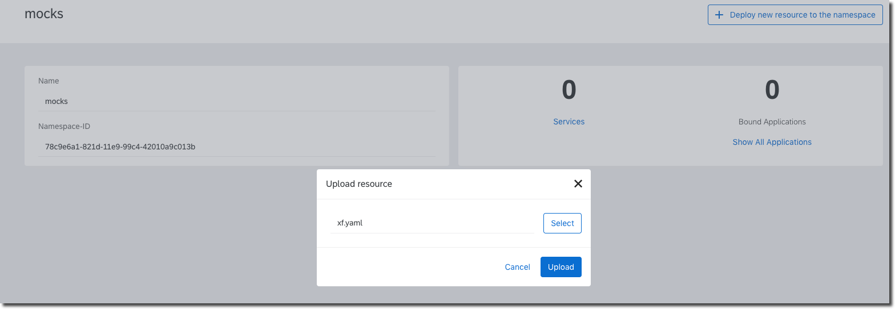
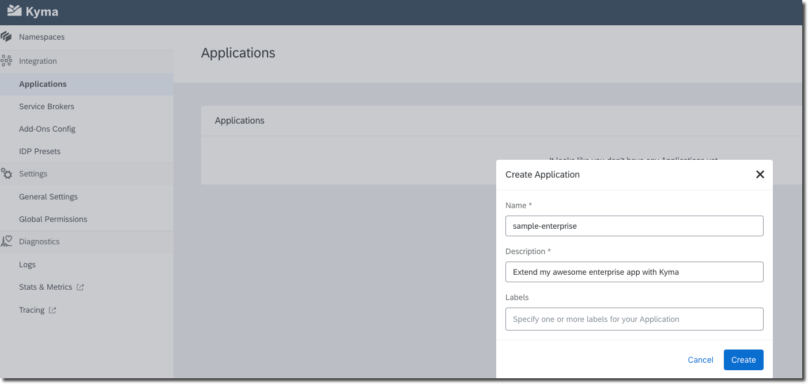
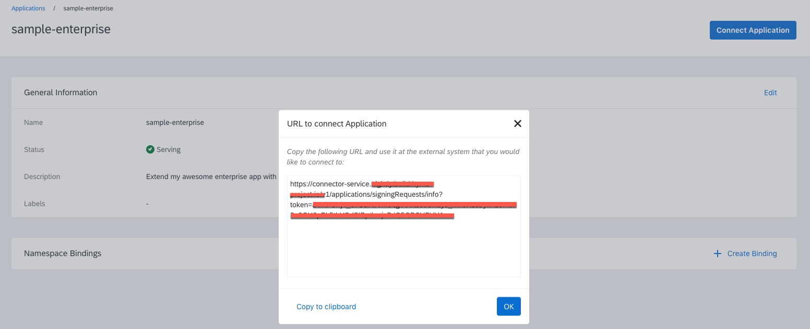
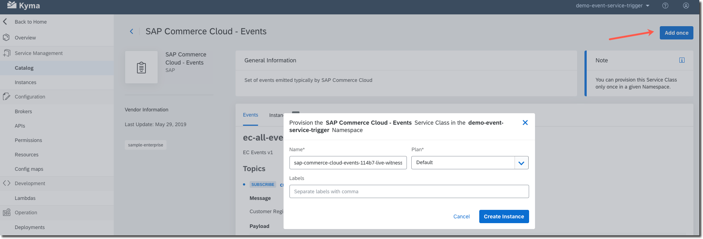
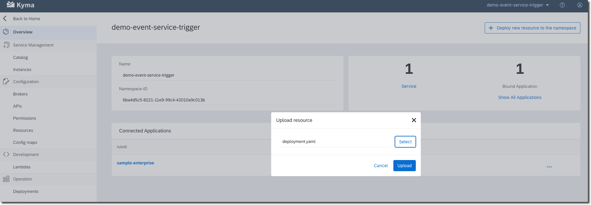
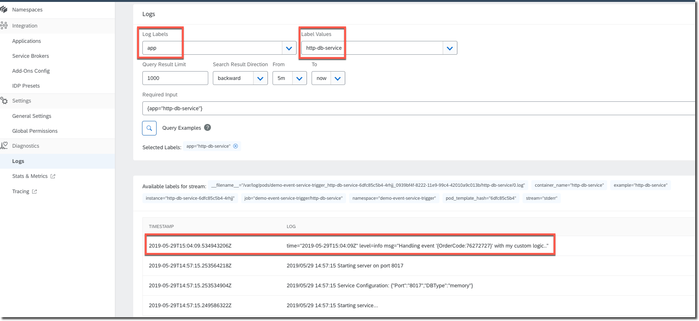

# Trigger a Microservice with an Event

This is an end-to-end guide that demonstrates how to set up an Event trigger for a microservice deployed in Kyma. It serves as a reference for developers who wish to configure their microservices with an Event trigger.

The guide uses:

* [**HTTP DB service**](https://github.com/kyma-project/examples/tree/master/http-db-service) as a reference microservice that is deployed in the `demo-event-service-trigger` Namespace. In this guide, you configure it to consume the **order.created** Event from the Application.
* [**Commerce mock**](https://github.com/SAP/xf-application-mocks/tree/master/commerce-mock) as a reference enterprise solution that connects to Kyma. In this guide, this Application sends the Event that triggers the microservice in Kyma.

## Set up the commerce mock

This section explains how to:

* Deploy the commerce mock Application in Kyma.

* Expose the commerce mock URL.

* Establish a secure connection using the Kyma Application Connector.

* Register the Events that can be sent from the commerce mock Application to Kyma.


1. Create a `mocks` Namespace in the Kyma Console UI.

    

1. Deploy the [commerce mock](https://raw.githubusercontent.com/SAP/xf-application-mocks/master/commerce-mock/deployment/xf.yaml).

    

1. Create a new `sample-enterprise` Application.

    

1. Copy the URL to connect the Application.

    

1. Access the commerce mock at `https://commerce.{CLUSTER_DOMAIN}`.

Complete these steps in the commerce mock UI:

1. Connect `sample-enterprise` to the commerce mock.

    
    
1. Register `SAP Commerce Cloud - Events`. After registration, it appears under the **Remote APIs** tab.

    

## Expose Events from the Application to a Namespace in Kyma

After the Application registered the Events that it can send to Kyma, you need to make them accessible to various serverless workloads running inside Kyma, such as lambdas and microservices. Since multiple applications can connect to Kyma, each Kyma Namespace is declaratively bound to an Application and then the Events are made accessible by adding the Event catalog to the Namespace.

1. Create the `demo-event-service-trigger` Namespace.

    

1. Bind the Application to the Namespace.

    

1. `SAP Commerce Cloud - Events` is available in the Catalog. Add it once to enable serverless workloads to consume Events.

    
    
    

## Deploy the service

Deploy the [HTTP DB service](https://raw.githubusercontent.com/kyma-project/examples/master/http-db-service/deployment/deployment.yaml). It exposes the `/events/order/created` endpoint to handle the **order.created** Event.

   
    
## Create the Kyma subscription

By creating a Kyma Subscription, you configure an **order.created** Event trigger for the microservice. This implies whenever the Application sends an **order.created** Event. The Event gets delivered as an HTTP **POST** request to the endpoint of the microservice.

1. Create the [Kyma subscription](./assets/event-trigger-subscription.yaml) by either deploying the Kyma Subscription custom resource from the Console UI or using the kubectl command.

    
	
> **TIP:** Refer to [custom resource parameters](https://github.com/kyma-project/kyma/blob/master/docs/event-bus/06-01-subscription.md#custom-resource-parameters) for details on all parameters. 

The main parameter is **endpoint** which takes the value in the `http://{service-name}.{namespace-in-which-service-is-deployed}:{service-port}/{uri-path-to-handle-events}` format.

```yaml
apiVersion: eventing.kyma-project.io/v1alpha1
kind: Subscription
metadata:
  name: example-subscription
  labels:
    example: example-subscription
spec:
  endpoint: http://http-db-service.demo-event-service-trigger:8017/events/order/created
  include_subscription_name_header: true
  max_inflight: 10
  push_request_timeout_ms: 60
  event_type: order.created
  event_type_version: v1
  source_id: sample-enterprise
```

## Send an Event and verify it

1. Send the Event from the commerce mock UI. It is accessible at `https://commerce.{CLUSTER_DOMAIN}`.

    * Go to `SAP Commerce Cloud - Events` under **Remote APIs**. 
    * Send the **order.created.v1** Event.
    
         

2. Access the logs and verify them.

    
